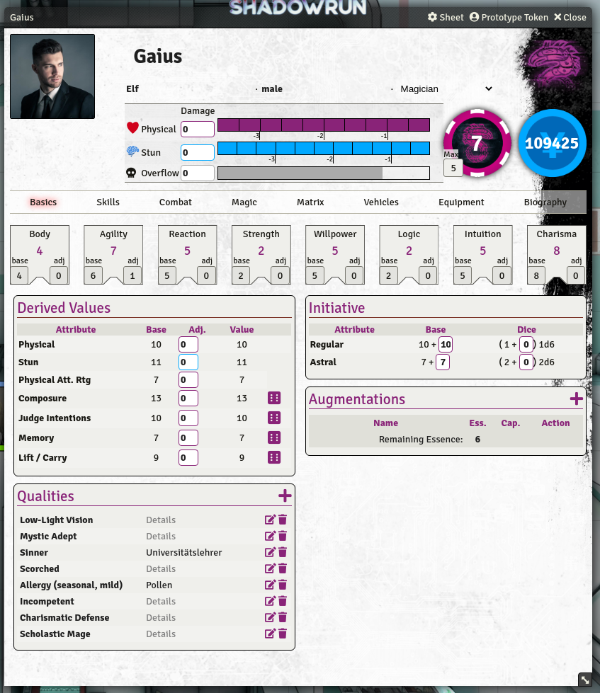
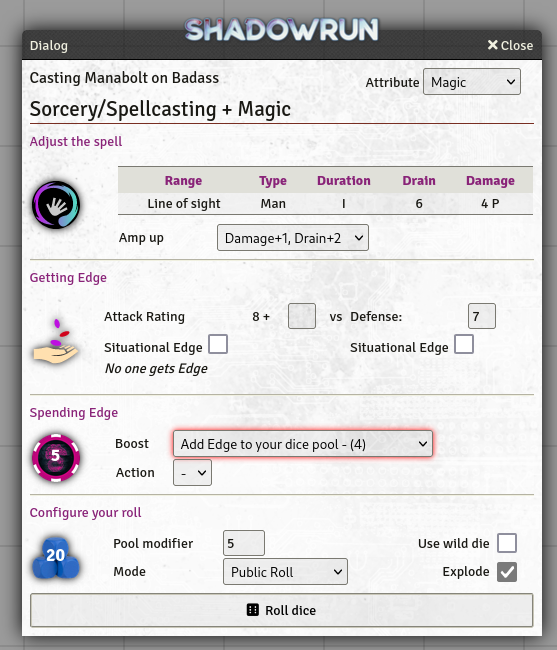

## Looking for a maintainer

As of end of  May 2024, I am no longer maintaining this project. I don't have enough time to take care of the game system AND it became apparent that with Foundry V12 and the removal of the Foundry v9 compatibility, the game system will require a good amount of work to be compatible again. (The [type definitions](https://github.com/League-of-Foundry-Developers/foundry-vtt-types) never could be updated to Foundry 10+ and I already had to make some ugly changes to get it running in v10/v11 without warnings, but now it completely broke.)
If you are either very familiar with TypeScript or willing to rebuild the code, contact me (e.g. via Discord: "taranion").

# Shadowrun 6 for Foundry VTT

This is the repository for the Foundry VTT system for the roleplaying system **Shadowrun 6**. It is a non-profit fan project and does not include contents from the publications.

**Installation-URL (Release/Stable):** [https://bitbucket.org/rpgframework-cloud/shadowrun6-eden/downloads/system.json](https://bitbucket.org/rpgframework-cloud/shadowrun6-eden/downloads/system.json) (**Requires Foundry 9.x**)

**Installation-URL (Beta/Unstable ):** [https://bitbucket.org/rpgframework-cloud/shadowrun6-eden/downloads/system-beta.json](https://bitbucket.org/rpgframework-cloud/shadowrun6-eden/downloads/system-beta.json)  (**Requires Foundry 10.x**)

**Documentation:** [Wiki](https://rpgframework.atlassian.net/wiki/spaces/SR6FVTT/)

**Discussion:** [Discord](https://discord.gg/USE9Gte)

