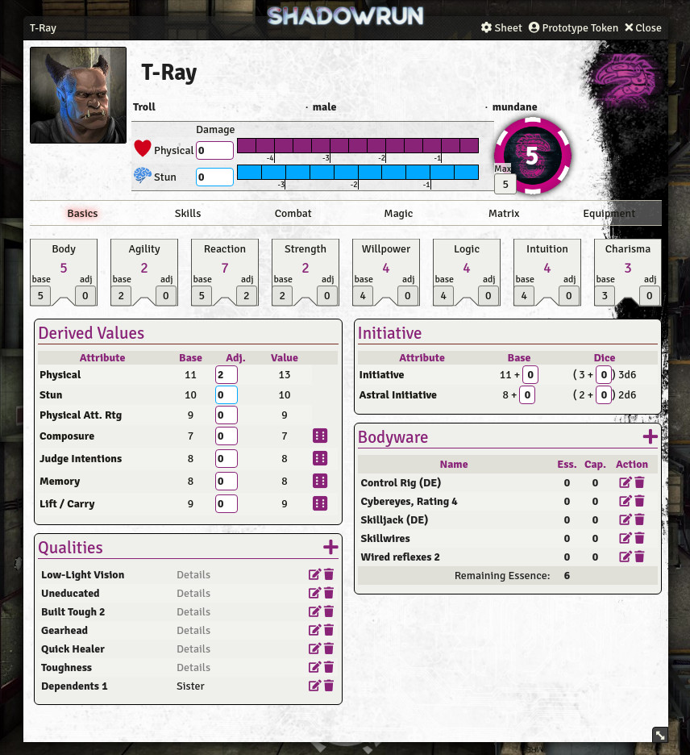
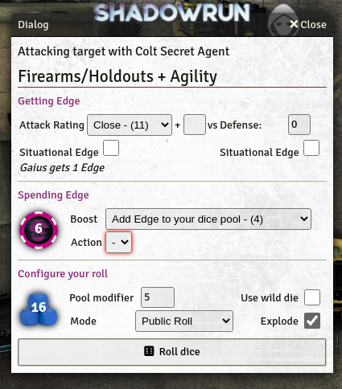

# Shadowrun 6 for Foundry VTT

This is the repository for the Foundry VTT system for the roleplaying system **Shadowrun 6**. It is a non-profit fan project and does not include contents from the publications.

*This system is under development and currently in very early stages - design and functionality may change without warning. Breaking changes are possible.*

**Installation-URL (Release/Stable):** Not released yet

**Installation-URL (Staging/Beta):** [https://bitbucket.org/rpgframework-cloud/shadowrun6-eden/downloads/system-staging.json](https://bitbucket.org/rpgframework-cloud/shadowrun6-eden/downloads/system-staging.json)  (**Requires Foundry 0.8.x**)

**Documentation:** [Wiki](https://rpgframework.atlassian.net/wiki/spaces/SR6FVTT/),  [Roadmap](https://rpgframework.atlassian.net/wiki/spaces/SR6FVTT/pages/1714421761/Roadmap)

**Discussion:** [Discord](https://discord.gg/USE9Gte)

**For Support:** [Patreon](https://patreon.com/rpgframework)

## Features ##

### Working ###
 * Attributes, Skills and specializations
 * Tracking physical and stun damage
 * Dice rolling (exploding dice and wild die)
 * Importing from Genesis (special Foundry JSON export)
 * German and English language support
 * Edge Tracking
 * Qualities (not their effects though)
 * (since 0.2.x) More derived attributes shown on the "Basics"-Tab
 * (since 0.2.x) An extra page with weapons and the possibility to make attack rolls with them
 * (since 0.2.x) Having selected a target, the weapons attack rating and defense rating are shown in the roll dialog
 * (since 0.2.x) Rolling initiative is working now
 * (since 0.2.x) Compatible with "Dice so Nice"
 * (since 0.2.x) Improve NPC sheet: Have skills on "Overview"-Tab, calculate initiative and actions, allow dice rolls
 * (since 0.3.x) Gear (Bodyware, Chemicals ...)
 * (since 0.3.x) Roll on derived attributes
 * (since 0.4.x) Magic: spells, adept powers, rituals, metamagic
 * (since 0.4.x) Attack and defense rating comparison, gaining edge, spending pre-roll edge
 * (since 0.5.x) Matrix devices, beginning support for edge based rerolls
 * (since 0.5.1) Added machine based translations for several languages 
 * (since 0.6.0) Begin support drones & vehicles, Biography tab
 
### Not working yet ###
 * Auto-calculating modifiers from condition monitors
 * Critters, better NPC support

## The future ##
Progess is rather slow, since Genesis and other projects keeps me busy. But I intend to keep adding functionality, until you can at least completely see everything you have in your Genesis character. 

