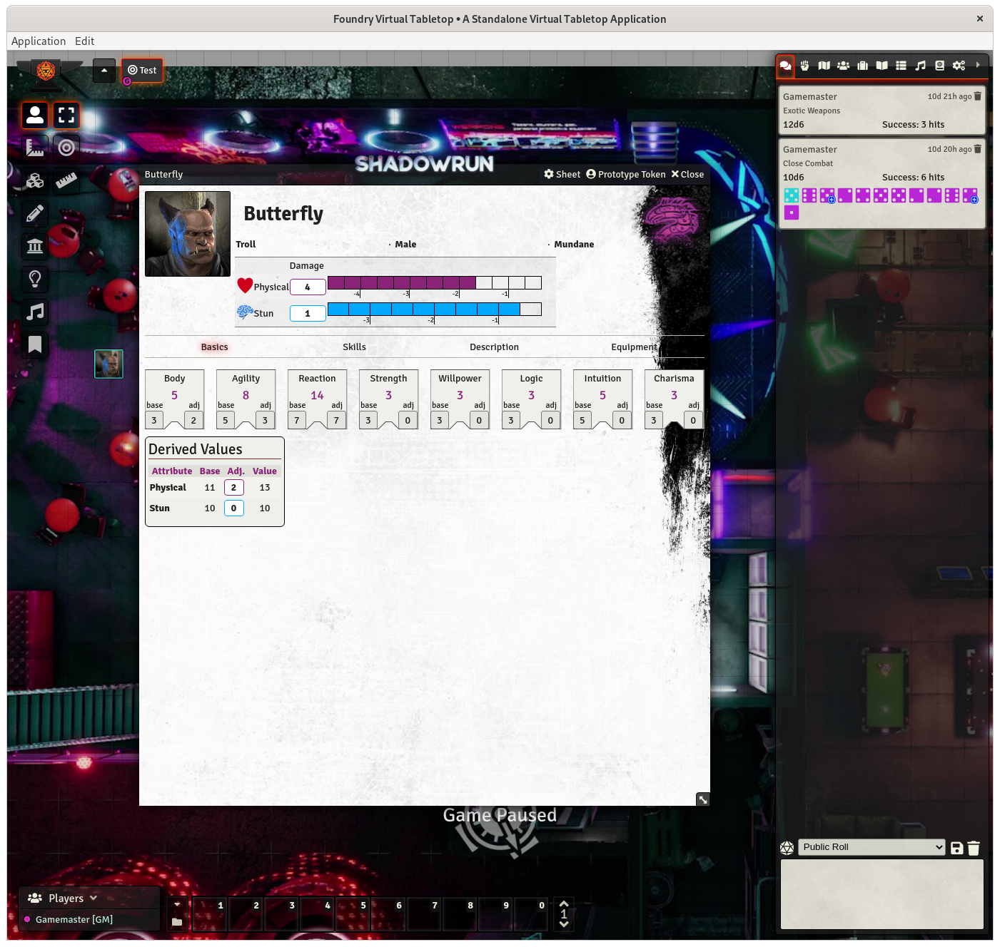

# Shadowrun 6 for Foundry VTT

This is the repository for the Foundry VTT system for the roleplaying system **Shadowrun 6**. It is a non-profit fan project and does not include contents from the publications.

*This system is under development and currently in very early stages - design and functionality may change without warning. Breaking changes are possible.

**Installation-URL (Staging/Beta):** [https://bitbucket.org/rpgframework-cloud/shadowrun6-eden/downloads/system-staging.json](https://bitbucket.org/rpgframework-cloud/shadowrun6-eden/downloads/system-staging.json)

## Features ##

### Working ###
 * Attributes, (Action) Skills
 * Tracking physical and stun damage
 * Dice rolling (exploding dice and wild die)
 * Importing from Genesis (special Foundry JSON export)
 * German and English language support
 
### Not working yet ###
 * Skill specializations, other skill types
 * Auto-calculating modifiers from condition monitors
 * Edge tracking
 * Gear and everything else character related (qualities, powers, spells ...)
 * Other actor types than SCs

## The future ##
Progess is rather slow, since Genesis and other projects keeps me busy. But I intend to keep adding functionality, until you can at least completely see everything you have in your Genesis character. 

